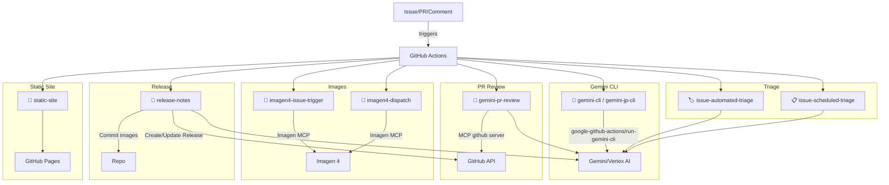

## 🏗️ アーキテクチャとワークフロー詳細

このドキュメントは、リポジトリ内のGitHub Actionsワークフローの全体像と詳細仕様をまとめたものです。トップレベルの概要は `README.md` を参照し、ここでは各ワークフローの目的・トリガー・実装上のポイントを詳述します。

### 全体像（Mermaid）

### 目的
- Issue/PR 由来のチャットオペレーションで Gemini を活用
- MCP GitHub サーバー経由の自動 PR レビュー
- イベント駆動とスケジュール駆動の Issue トリアージ
- Imagen MCP による画像生成とコミット
- リリース画像とリリースノートの自動生成
- GitHub Pages への静的サイト公開

---

### ワークフロー詳細

- 💬 `/.github/workflows/gemini-cli.yml`, `/.github/workflows/gemini-jp-cli.yml`
  - トリガー: Issue/コメント/PRレビューコメント/レビュー提出/手動（条件付き）
  - 役割: CLIライクな対話。`google-github-actions/run-gemini-cli@v0` を利用
  - 実装ポイント: ヒアドキュメントで `GITHUB_OUTPUT` を安全に書き込み。イベント種別に依存しにくい Concurrency グループ設計

- 🧐 `/.github/workflows/gemini-pr-review.yml`
  - トリガー: PR ライフサイクル（opened, synchronize 等）や opt-in コメント
  - 役割: MCP GitHub サーバーでレビューコメントを PR に直接投稿
  - 注意: 変更ハンク内のみコメント可能というGitHubの制約に準拠

- 🏷️ `/.github/workflows/gemini-issue-automated-triage.yml`
  - トリガー: Issue opened/reopened、手動
  - 役割: Issue の内容に基づく自動ラベル付け/担当者提案
  - 実装ポイント: 不在ラベルは作成後に適用

- 📋 `/.github/workflows/gemini-issue-scheduled-triage.yml`
  - トリガー: スケジュール（cron）
  - 役割: 未トリアージIssueを定期バッチで分析
  - 実装ポイント: JSON取扱いの堅牢化、フォールバックラベル適用

- 🎨 `/.github/workflows/imagen4-issue-trigger-and-commit.yml`
  - トリガー: Issue/コメントなど（イシュー起点）
  - 役割: Imagen MCP で画像生成、メタデータ付与、生成物をコミット
  - 出力: 結果をIssueへコメント（Raw 画像リンク）

- 🎨 `/.github/workflows/imagen4-generate-and-commit.yml`
  - トリガー: 手動/ディスパッチ
  - 役割: 任意プロンプトで画像生成しコミット

- 📝 `/.github/workflows/gemini-release-notes.yml`
  - トリガー: リリースタグ作成
  - 役割: ヘッダー画像生成、要点を押さえたリリースノート作成
  - 出力: 画像コミット + Release アセットへのアップロード

- 📄 `/.github/workflows/static-site.yml`
  - トリガー: main への push や手動
  - 役割: リポジトリ内容を GitHub Pages に公開

- 🔄 `/.github/workflows/sync-to-report-gh.yml`
  - トリガー: main への push
  - 役割: 旧テンプレのレガシー。現在は参考用途

---

### セキュリティ/運用メモ
- 機密情報はコミットしない（例: `discord-issue-bot/.env` は `.gitignore` 済み）
- トークン/鍵はリポジトリ/Org Secrets/Vars を利用（例: `GEMINI_API_KEY`, `GH_PAT`）
- 書き込み系ジョブは信頼できるユーザー/イベントに限定
- イシュー/PR/コメント起点でも競合しにくい Concurrency グループ設計
